# Digital Image Processing (Ψηφιακή Επεξεργασία Εικόνας) — AUTh ECE

[](https://www.python.org/)
[](https://numpy.org/)
[](https://opencv.org/)
[](https://scipy.org/)
[](https://matplotlib.org/)
[](LICENSE)
[](https://ece.auth.gr/)

Academic coursework and software implementations for **Digital Image Processing (Ψηφιακή Επεξεργασία Εικόνας)**, taught in the 8th semester (Spring 2024) at the Department of Electrical and Computer Engineering, **Aristotle University of Thessaloniki (AUTh)**.

**Author**: Dimitrios Ioannidis  
**Academic Year**: 2023 – 2024 (8th Semester)

---

## 📌 Overview

This repository contains algorithmic implementations and applications covering classical and modern computer vision and digital image processing techniques:

1. **Histogram Processing**: Cumulative Distribution Function (CDF) mapping, **Global Histogram Equalization (GHE)**, and **Adaptive Histogram Equalization (AHE)** with contextual bilinear interpolation.
2. **Feature Detection & Document Scanner**: Edge detection (Canny), line detection via the **Hough Transform**, corner detection via the **Harris Corner Detector**, and perspective homography rectification for building an automated document scanner from raw tilted smartphone photos.
3. **Image Restoration & Deconvolution**: Spatial and frequency-domain degradation modeling (linear motion blur and additive Gaussian noise), unconstrained **Inverse Filtering** (illustrating ill-posed noise amplification), and regularized **Wiener Deconvolution** with Mean Squared Error (MSE) hyperparameter optimization ($K$).

---

## 📁 Repository Structure

```text
digital-image-processing-auth-2024/
├── 01-histogram-equalization/
│   ├── assignment/
│   │   └── dip-2024-hw1-v2.pdf                 # Original assignment specification (in Greek)
│   ├── assets/
│   │   ├── original_image.png                  # Grayscale input image
│   │   ├── global_equalization_transform.png   # Monotonic CDF transformation curve
│   │   ├── globally_equalized.png              # Image enhanced with Global Histogram Equalization
│   │   ├── global_hist_comparison.png          # Input vs. Globally Equalized histograms
│   │   ├── adaptively_equalized.png            # Image enhanced with AHE & bilinear interpolation
│   │   ├── adaptive_hist_comparison.png        # Input vs. Adaptively Equalized histograms
│   │   └── ahe_no_interpolation.png           # AHE without interpolation (showing boundary artifacts)
│   ├── adaptive_hist_eq.py                     # Contextual region AHE & bilinear interpolator
│   ├── demo.py                                 # Demonstration script comparing GHE and AHE
│   ├── global_hist_eq.py                       # Global histogram calculation and CDF mapping
│   └── input_img.png                           # Benchmark low-contrast input image
│
├── 02-hough-transform-and-harris-corner-detection/
│   ├── assignment/
│   │   └── dip-2024-hw2.v1.pdf                 # Original assignment specification (in Greek)
│   ├── assets/
│   │   ├── harris_corner_detection_result.png  # Detected paper document corners
│   │   ├── rotated_image_54_degrees.png        # Rotated document orientation test
│   │   ├── rotated_image_213_degrees.png       # Rotated document orientation test
│   │   └── im1_1.jpg ... im5_2.jpg             # Perspective-corrected scanned document outputs
│   ├── deliverable_1.py                        # Hough transform line detection
│   ├── deliverable_2.py                        # Harris corner detection and corner scoring
│   ├── deliverable_3.py                        # Document orientation analysis and rotation correction
│   ├── my_lazy_scanner.py                      # End-to-end automated smartphone document scanner
│   └── im1.jpg ... im5.jpg                     # Real-world tilted smartphone photograph inputs
│
├── 03-image-restoration-and-wiener-filtering/
│   ├── assignment/
│   │   └── dip-2024-hw3-v1.pdf                 # Original assignment specification (in Greek)
│   ├── assets/
│   │   ├── cameraman/                          # Cameraman degradation and restoration gallery
│   │   │   ├── noise_0.02_motion_blur_10_angle_0_y.png       # Degraded input (motion blur + noise)
│   │   │   ├── noise_0.02_motion_blur_10_angle_0_x_inv.png   # Unconstrained inverse filter (noise blowup)
│   │   │   ├── noise_0.02_motion_blur_10_angle_0_x_hat.png   # Optimal Wiener restored output
│   │   │   └── noise_0.02_motion_blur_10_angle_0_MSE_vs_K.png# MSE vs. regularization parameter K
│   │   └── checkerboard/                       # Checkerboard degradation and restoration gallery
│   ├── cameraman.tif                           # Standard Cameraman benchmark image
│   ├── checkerboard.tif                        # Standard Checkerboard benchmark image
│   ├── demo.py                                 # Comprehensive restoration benchmark script
│   ├── hw3_helper_utils.py                     # Optical Transfer Function (OTF) & blur generation
│   └── wiener_filtering.py                     # Inverse filter and Wiener deconvolution implementations
│
├── .gitignore                                  # Standard Python, LaTeX, and OS ignores
├── LICENSE                                     # MIT License
├── README.md                                   # Course showcase documentation
└── requirements.txt                            # Project dependencies
```

---

## 🔬 Assignments Breakdown & Results

### 1. Histogram Equalization: Global vs. Adaptive (`01-histogram-equalization`)

Histogram equalization enhances image contrast by redistributing pixel luminance values so that the output probability density function (PDF) approximates a uniform distribution.

- **Global Histogram Equalization (GHE)**:
  - Computes the discrete normalized histogram $p_r(r_k) = \frac{n_k}{MN}$ for $k \in [0, L-1]$.
  - Applies the monotonic Cumulative Distribution Function (CDF) transformation:
    $$s_k = T(r_k) = (L - 1) \sum_{j=0}^{k} p_r(r_j)$$
  - Works well for globally underexposed/overexposed images, but can wash out local details when contrast varies widely across different regions.
- **Adaptive Histogram Equalization (AHE)**:
  - Partitions the image into $M_r \times N_r$ contextual rectangular tiles and computes local equalization mappings for each tile independently.
  - **Bilinear Interpolation**: To avoid severe blocking boundaries between adjacent tiles (demonstrated in `ahe_no_interpolation.png`), each pixel luminance is interpolated from the CDF mappings of its 4 nearest tile centers:
    $$I_{AHE}(x, y) = (1-s)(1-t) T_{11}(I) + s(1-t) T_{21}(I) + (1-s)t T_{12}(I) + st T_{22}(I)$$

#### 📊 Results Showcase

| Original Low-Contrast Image | Global Equalization Transform $T(r_k)$ |
| :---: | :---: |
| 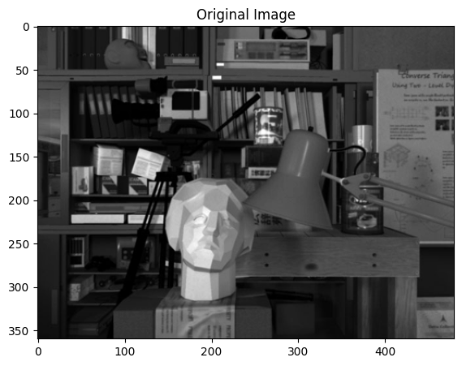 | 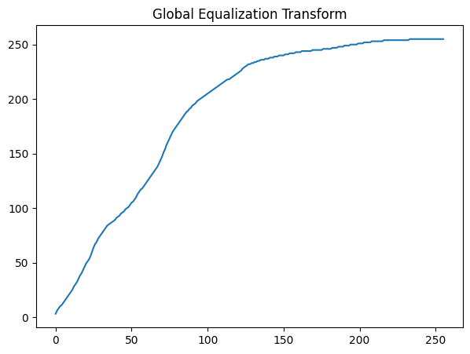 |

| Global Histogram Equalization (GHE) | Adaptive Histogram Equalization (AHE) |
| :---: | :---: |
| 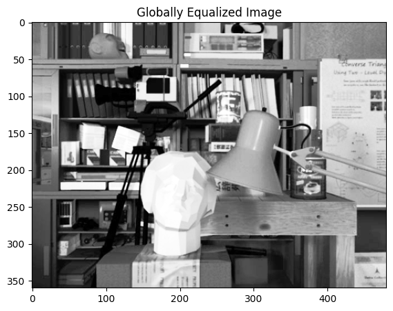 | 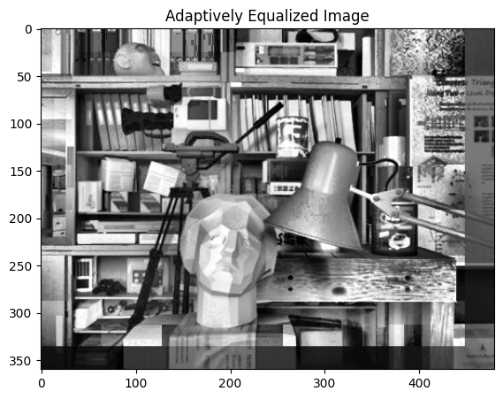 |

| AHE Without Bilinear Interpolation (Blocking Artifacts) | AHE With Bilinear Interpolation (Smooth Transition) |
| :---: | :---: |
| 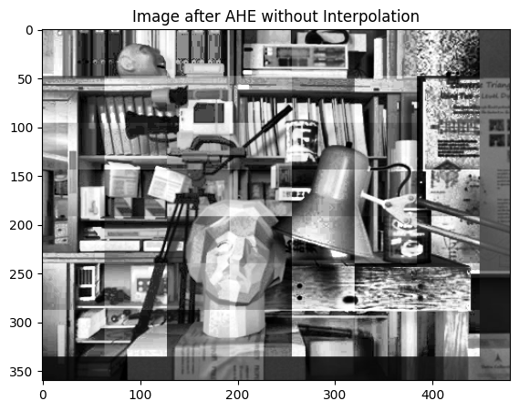 |  |

📄 **Original Assignment Spec**: [dip-2024-hw1-v2 (PDF)](01-histogram-equalization/assignment/dip-2024-hw1-v2.pdf)

---

### 2. Feature Detection & Automated Document Scanner (`02-hough-transform-and-harris-corner-detection`)

This project implements an end-to-end computer vision pipeline that automatically detects paper documents photographed at arbitrary angles/perspectives and rectifies them into clean, front-facing document scans.

- **Edge Detection & Hough Line Transform (`deliverable_1.py`)**:
  - Detects boundary edges using the Canny operator.
  - Maps edge pixels into the polar accumulator space: $r = x\cos\theta + y\sin\theta$.
  - Identifies the dominant geometric boundary lines forming the rectangular document border.
- **Harris Corner Detection (`deliverable_2.py`)**:
  - Computes the spatial structure tensor (second moment matrix) via image gradients:
    $$\mathbf{M} = \sum_{(x,y) \in W} w(x,y) \begin{bmatrix} I_x^2 & I_x I_y \\ I_x I_y & I_y^2 \end{bmatrix}$$
  - Evaluates the corner response function:
    $$R = \det(\mathbf{M}) - k \, \mathrm{Tr}(\mathbf{M})^2 = \lambda_1 \lambda_2 - k (\lambda_1 + \lambda_2)^2$$
  - Applies non-maximum suppression (NMS) to localize corner points on the document boundary.
- **Perspective Rectification (`my_lazy_scanner.py`)**:
  - Matches the 4 outer document corners with an upright rectangular destination canvas $[W \times H]$.
  - Solves for the $3 \times 3$ perspective homography matrix $\mathbf{H}$ and applies inverse bilinear warping to produce flat, rectified scans.

#### 📊 Results Showcase

| Harris Corner Detection | Detected Paper Corners |
| :---: | :---: |
| 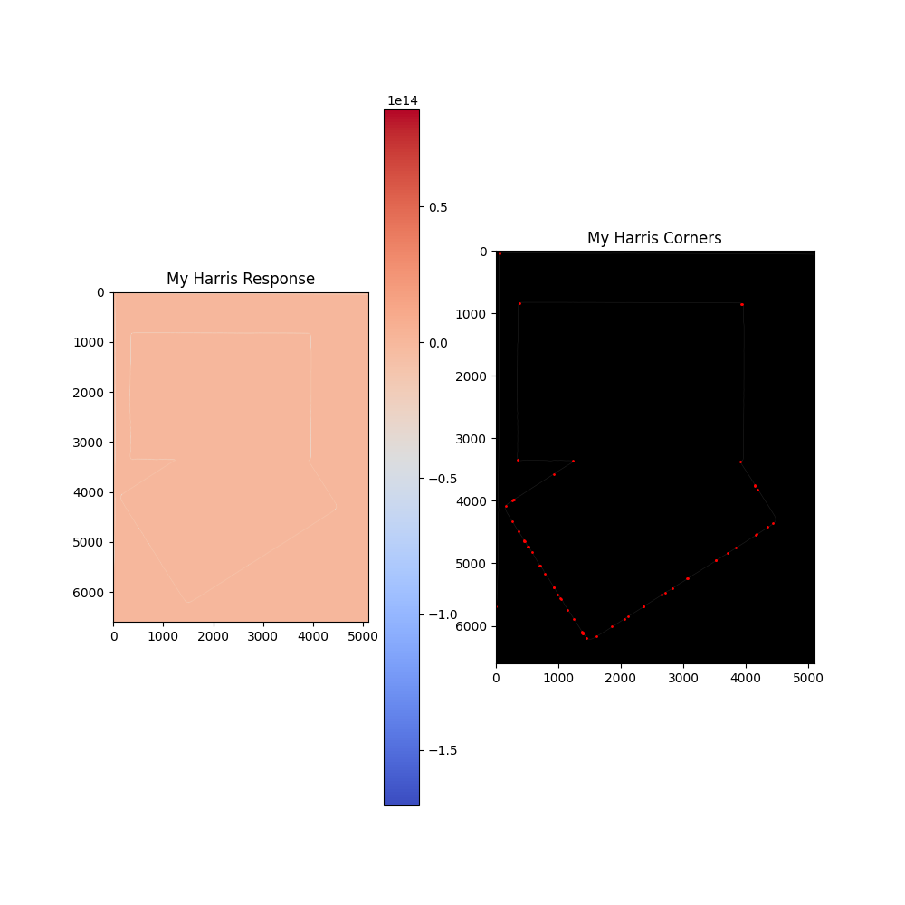 | 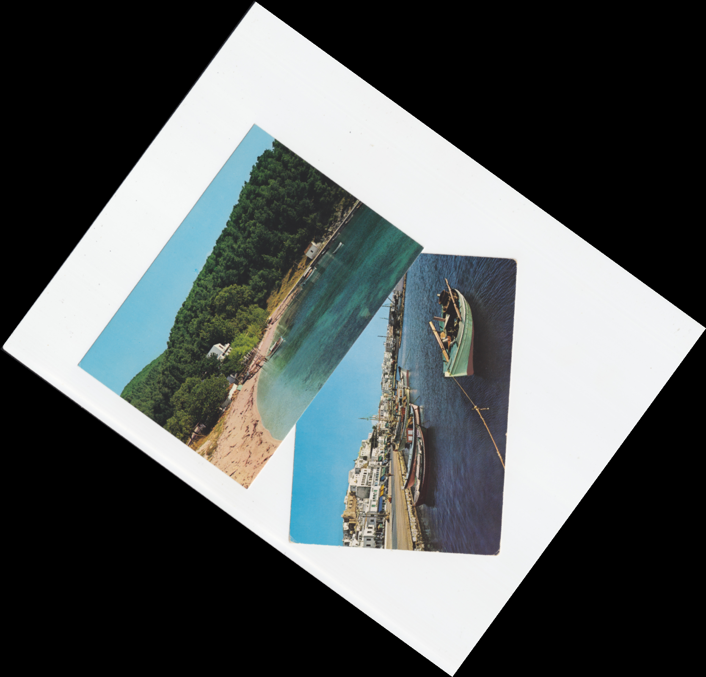 |

| Raw Tilted Input Photo (`im1.jpg`) | Automated Rectified Document Scan (`im1_1.jpg`) |
| :---: | :---: |
| 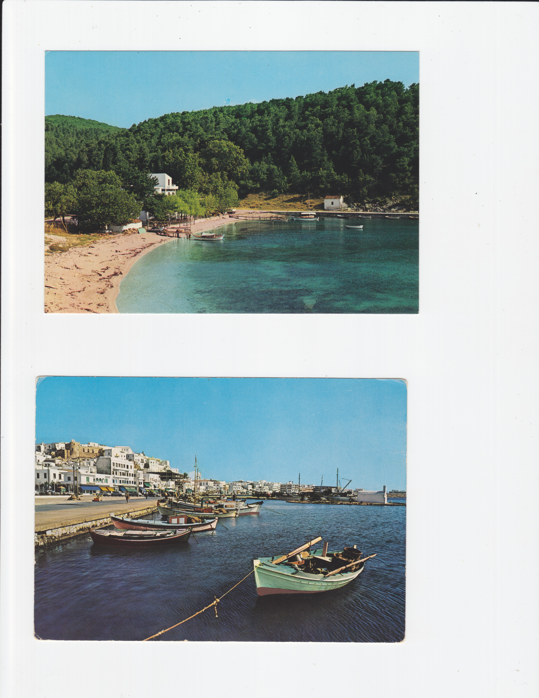 | 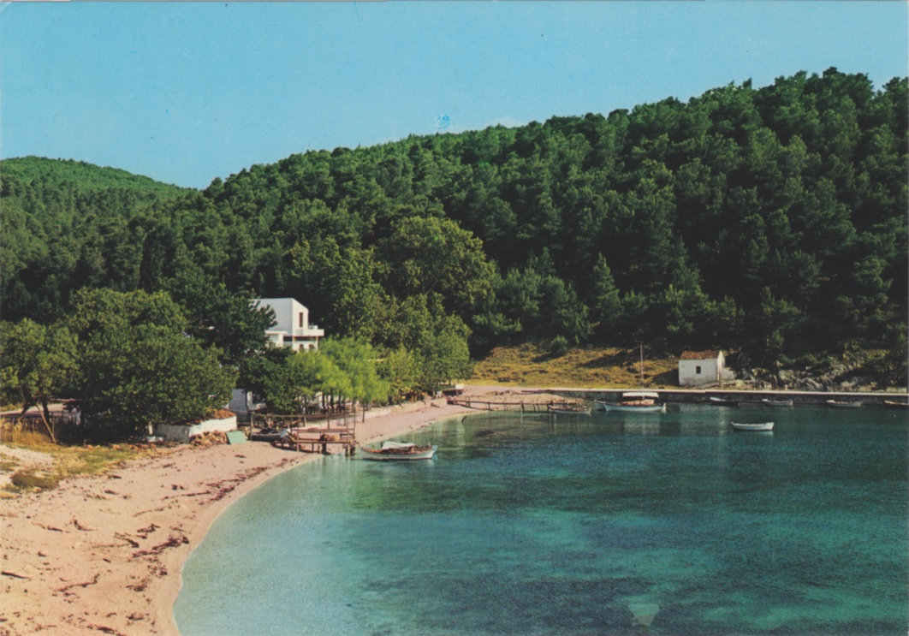 |

| Raw Tilted Input Photo (`im2.jpg`) | Automated Rectified Document Scan (`im2_1.jpg`) |
| :---: | :---: |
| 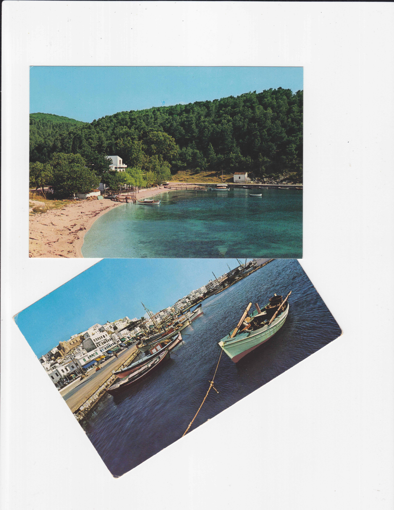 |  |

📄 **Original Assignment Spec**: [dip-2024-hw2.v1 (PDF)](02-hough-transform-and-harris-corner-detection/assignment/dip-2024-hw2.v1.pdf)

---

### 3. Image Restoration & Wiener Deconvolution (`03-image-restoration-and-wiener-filtering`)

Image restoration aims to reconstruct an unknown ground truth image $f(x, y)$ from a degraded observation $g(x, y)$ affected by linear blur and noise:
$$G(u, v) = H(u, v) F(u, v) + N(u, v)$$

- **Linear Motion Blur Transfer Function ($H(u,v)$)**:
  Models atmospheric or camera motion of length $L$ at angle $\theta$ via the optical transfer function (OTF):
  $$H(u,v) = \frac{1}{\pi(u a + v b)} \sin(\pi(u a + v b)) e^{-j\pi(u a + v b)}, \quad a = L\cos\theta, \; b = L\sin\theta$$
- **The Ill-Posed Nature of Inverse Filtering**:
  Direct inverse filtering $\hat{F}_{inv}(u,v) = \frac{G(u,v)}{H(u,v)} = F(u,v) + \frac{N(u,v)}{H(u,v)}$ catastrophic fails in the presence of noise because frequencies where $H(u,v) \approx 0$ amplify the noise term $\frac{N(u,v)}{H(u,v)}$ to infinity (as demonstrated by the severe noise blowup in the results below).
- **Wiener Filter (Minimum Mean Square Error Deconvolution)**:
  Incorporates a regularization parameter $K \approx \frac{S_\eta(u,v)}{S_f(u,v)}$ balancing inverse filtering against noise suppression:
  $$W(u, v) = \frac{H^*(u, v)}{|H(u, v)|^2 + K}$$
- **Hyperparameter Search**: Sweeps $K \in [10^{-5}, 10^0]$ to locate the global minimum Mean Squared Error (MSE) with respect to the ground truth.

#### 📊 Results Showcase: Inverse Filtering vs. Wiener Deconvolution

| Degraded Input (Motion Blur + Noise) | Unconstrained Inverse Filter (Noise Amplification) | Optimal Wiener Filter Restoration ($\hat{x}$) |
| :---: | :---: | :---: |
| 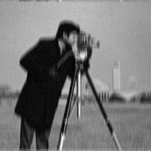 | 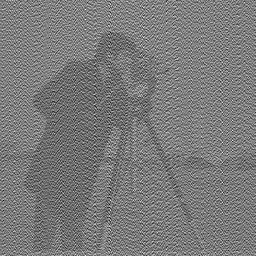 | 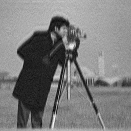 |

#### 📊 Regularization Parameter Optimization (MSE vs. K)

Optimal $K$ minimizes the error between ground truth $x$ and estimate $\hat{x}$, finding the exact balance point between high-frequency detail recovery and noise attenuation:

<p align="center">
  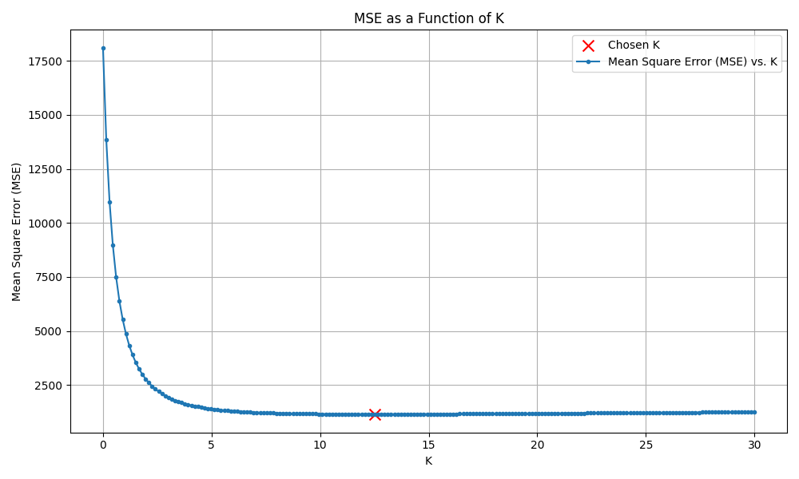
</p>

📄 **Original Assignment Spec**: [dip-2024-hw3-v1 (PDF)](03-image-restoration-and-wiener-filtering/assignment/dip-2024-hw3-v1.pdf)

---

## 💻 Running the Demos

Install dependencies (`pip install -r requirements.txt`) and run any assignment demo:

```bash
# 1. Histogram Equalization
cd 01-histogram-equalization
python demo.py               # Compares GHE and AHE, saving plots to assets/

# 2. Automated Document Scanner
cd ../02-hough-transform-and-harris-corner-detection
python my_lazy_scanner.py    # Runs full scanner pipeline on sample smartphone photos

# 3. Image Restoration & Wiener Filtering
cd ../03-image-restoration-and-wiener-filtering
python demo.py               # Runs Wiener deconvolution and generates MSE vs. K curves
```
